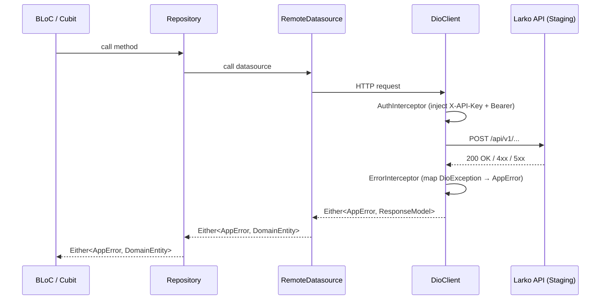
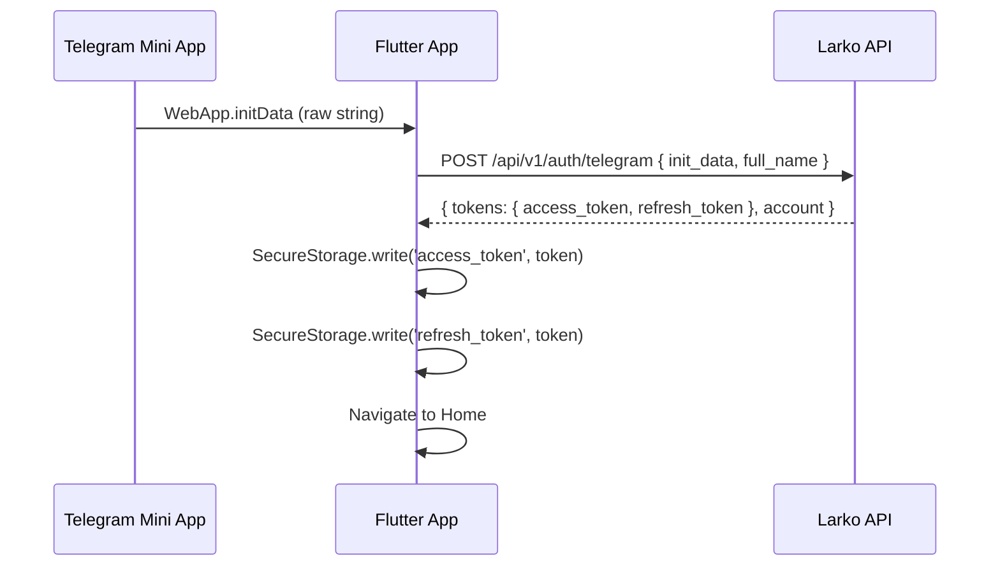

# IMPLEMENTED_API_[SCREEN_NAME].md

> **Role**: API_Backend_Integrator
> **Skill**: SKILL_API_INTEGRATE
> **Screen**: [SCREEN_NAME]
> **Date**: [YYYY-MM-DD]
> **Status**: 🔄 In Progress | ✅ Done | ❌ Blocked

---

## §Endpoint Map

| Flow Action | HTTP Method | Path | Swagger operationId | Request Model | Response Model | Status |
|---|---|---|---|---|---|---|
| [e.g. Submit time log] | POST | /api/v1/timelogs | createTimelog | TimelogCreateDto | TimelogResponse | ✅ Integrated |

---

## §Input Review

| Document | Read | Notes |
|---|---|---|
| adr/ADR_SCREEN_[NAME].md | ✅ | [key constraints noted] |
| dad/DAD_[SCOPE].md | ✅ | [sync strategy: local-first/server-first] |
| tech-stack/TECH_STACK_[NAME].md | ✅ | [key interfaces noted] |
| scenario/SCREEN_[NAME].md | ✅ | [flows counted: N] |
| backend/api_endpoints_reference.md | ✅ | |
| backend/api_endpoints_detailed.md | ✅ | |
| backend/frontend_integration_guide.md | ✅ | |
| backend/error_codes.md | ✅ | |
| Swagger URL | ✅/❌ | [URL or "not provided"] |

---

## Phase 1 — API Client Infrastructure

### Action
[Describe what was done: created DioClient, added interceptors, etc.]

### Files Created/Modified
- `lib/core/network/dio_client.dart` — [NEW / MODIFIED]
- `lib/core/network/auth_interceptor.dart` — [NEW / MODIFIED]
- `lib/core/network/error_interceptor.dart` — [NEW / MODIFIED]
- `lib/core/constants/api_constants.dart` — [NEW / MODIFIED]
- `lib/core/errors/app_error.dart` — [NEW / MODIFIED]

### Architecture Diagram



### Verification Gate: PASS ✅ / FAIL ❌
- API client infrastructure: ...
- Interceptors: ...
- AppError sealed class: ...

---

## Phase 2 — Models

### [EntityName] Model

**Endpoint**: `[METHOD] [PATH]`

**Contract Delta**:
| API Field | Type | Dart Field | Type | Status |
|---|---|---|---|---|
| `id` | string (UUID) | `id` | String | ✅ mapped |
| `created_at` | string (ISO8601) | `createdAt` | DateTime | ✅ mapped |
| [field] | [type] | [dartField] | [type] | ✅ / ⚠️ delta |

### Files
- `lib/data/models/[entity]_model.dart` — [NEW / MODIFIED]

### Verification Gate: PASS ✅ / FAIL ❌
[notes]

---

## Phase 3 — Remote Datasource

### [Entity] Datasource

**Methods integrated**:
- `create[Entity]()` → `POST [PATH]`
- `get[Entity]List()` → `GET [PATH]`

### Files
- `lib/data/remote/[entity]_remote_datasource.dart` — [NEW / MODIFIED]

### Verification Gate: PASS ✅ / FAIL ❌
- Every method: `Either<AppError, T>`: ...
- No inline headers: ...
- Error coverage (401, 403, 404, 409, 422, 429, 5xx): ...

---

## Phase 4 — Repository Wiring

### [Entity] Repository

**Sync strategy** (from DAD §6): [local-first / server-first]

**Methods wired**:
- `[method]()`: mock removed ✅, real API connected ✅

### Mock Removal Audit
```
grep -r "MockData\|mockService\|isMock" lib/ | grep [screen_name]
# Result: 0 hits ✅
```

### Files
- `lib/data/repositories/[entity]_repository_impl.dart` — MODIFIED

### Verification Gate: PASS ✅ / FAIL ❌
[notes]

---

## Phase 5 — Auth Integration (if applicable)

### Flow: Telegram initData → JWT → SecureStorage



### Verification Gate: PASS ✅ / FAIL ❌
- initData from WebApp.initDataRaw: ...
- Token stored in SecureStorage: ...
- 401 → clear token → auth screen: ...

---

## Phase 6 — API Integration Gate

### flutter analyze
```
flutter analyze --no-pub
# Result: 0 errors ✅ / [N errors ❌]
```

### validate_api_integration.sh
```
.agents/skills/SKILL_API_INTEGRATE/scripts/validate_api_integration.sh [SCREEN_NAME]
# Result: PASS ✅ / FAIL ❌
```

### Network Verification (Staging)

| Endpoint | Status | Notes |
|---|---|---|
| `POST /api/v1/timelogs` | 201 ✅ | Response: TimelogResponse |

### Summary

- Integrated endpoints: [N]
- Active mocks for this screen: NONE ✅
- flutter analyze: 0 errors ✅
- validate_api_integration.sh: PASS ✅
- Network evidence: [screenshot reference or log excerpt]

**Integration Gate: PASS ✅ / FAIL ❌**

---

## §Open Questions

| # | Type | Question | Answer / Fallback |
|---|---|---|---|
| Q1 | [BLOCKING] | [question] | [answer or fallback assumption] |

---

## §Developer Notes

[Integration hints, gotchas, known issues, future improvements]
