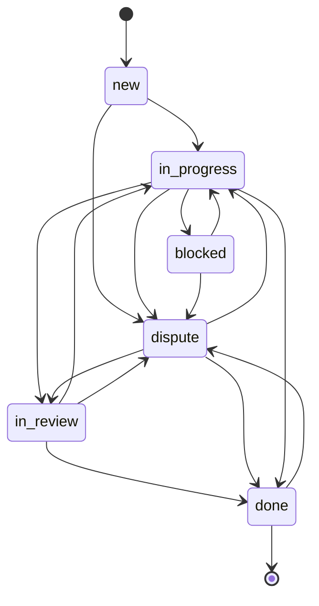

# Architecture Decision Records (ADR) — Larko Backend

> **Версія**: 1.0
> **Дата**: 2026-03-31
> **Проєкт**: Larko — Multi-tenant SaaS Workforce Management Backend
> **Стек**: Python 3.12, FastAPI, SQLAlchemy 2.0 (async), PostgreSQL, Alembic, Supabase Auth

---

## ADR-001: Модульна архітектура (Feature-based Modules)

### Статус
✅ Прийнято

### Контекст
Проєкт потребує чіткого розділення бізнес-логіки для 14 доменних областей. Монолітний підхід з однією папкою `models/`, `services/`, `routes/` масштабується погано — зв'язність зростає, а команда не може працювати паралельно.

### Рішення
Кожна бізнес-область — самостійний модуль в `app/features/<module>/`:

```
app/features/
├── audit/          # Аудит змін
├── auth/           # Реєстрація, логін, JWT
├── billing/        # Підписки, тарифні плани
├── catalog/        # Типи робіт (ProductType)
├── clients/        # Клієнти компанії
├── companies/      # Компанії (мультитенант)
├── content/        # FAQ, інструкції
├── finance/        # Аванси, корекції, баланси
├── members/        # Учасники команди
├── notifications/  # Telegram, push
├── orders/         # Замовлення (FSM)
├── public_api/     # Зовнішній API (API ключі)
├── timelogs/       # Табелі робочого часу
└── workflows/      # Відпустки, диспути
```

Кожен модуль містить:
- `models.py` — SQLAlchemy ORM моделі
- `schemas.py` — Pydantic V2 DTO
- `service.py` — бізнес-логіка
- `router.py` — FastAPI ендпоінти

### Наслідки
- ✅ Чітке Domain Ownership — кожен модуль відповідає за свої таблиці
- ✅ Паралельна розробка без merge конфліктів
- ✅ Легке масштабування (модуль можна витягнути в мікросервіс)
- ⚠️ Потребує суворих правил щодо міжмодульної комунікації (див. ADR-002)

---

## ADR-002: Суворо ізольовані модульні межі

### Статус
✅ Прийнято (уточнено 2026-03-31)

### Контекст
Модулі починали імпортувати ORM моделі один з одного (`from app.features.orders.models import Order`), що створювало tight coupling, circular dependency ризики, і неможливість рефакторити таблицю без каскадних змін.

### Рішення
**Строге правило**: кожен модуль має доступ ТІЛЬКИ до своїх моделей. Міжмодульна комунікація відбувається через:

1. **Service-to-Service контракти** — метод в сервісі цільового модуля, який повертає DTO:
   ```python
   # OrderService — контрактний метод для інших модулів
   async def unassign_worker_from_active_orders(self, member_id, company_id):
       """Contract: інші модулі викликають цей метод замість прямого SQL."""
   ```

2. **Параметризовані raw SQL** — для read-only операцій, де створювати сервіс-контракт надто дорого:
   ```python
   # Замість: from app.features.orders.models import Order
   stmt = text("SELECT company_id, status FROM orders WHERE id = :oid")
   ```

### Правила
| Дозволено | Заборонено |
|---|---|
| `from app.features.orders.service import OrderService` | `from app.features.orders.models import Order` |
| `text("SELECT ... FROM orders WHERE ...")` | `select(Order).where(Order.id == ...)` |
| Контрактний метод `OrderService.get_orders_bulk_dict()` | Прямий JOIN через ORM: `select(TimeLog).join(Order)` |

### Наслідки
- ✅ Модулі можна рефакторити незалежно (зміна схеми Order не ламає TimeLogs)
- ✅ Немає circular imports
- ⚠️ Raw SQL потребує ручної підтримки при зміні колонок
- ⚠️ Контрактні методи треба документувати і тестувати

---

## ADR-003: Мультитенантність через Company-scoped дані

### Статус
✅ Прийнято

### Контекст
Larko — SaaS платформа. Один користувач може бути учасником кількох компаній з різними ролями. Потрібна надійна ізоляція даних між компаніями.

### Рішення
**Company-scoped data model**:

```
Account (1) ←→ (N) CompanyMember ←→ (1) Company
                    ↓
              role: owner | manager | worker
```

- Кожна бізнес-сутність має `company_id` FK
- `CompanyMember` — pivot таблиця з полем `role` (per-company роль)
- Один `Account` може мати різні ролі в різних компаніях
- Всі запити фільтруються по `company_id` через RBAC залежності

### Наслідки
- ✅ Повна ізоляція даних між компаніями
- ✅ Один користувач — кілька компаній з різними правами
- ✅ Простий горизонтальний скейлінг (sharding по company_id)

---

## ADR-004: RBAC через FastAPI Dependency Injection

### Статус
✅ Прийнято

### Контекст
Потрібна система контролю доступу, яка: (a) перевіряє що користувач — член компанії, (b) перевіряє роль користувача, (c) запобігає IDOR атакам (доступ до чужих ресурсів).

### Рішення
Ієрархія FastAPI залежностей в `app/core/dependencies.py`:

```
require_company_member        → перевірка членства + active статус + soft-delete компанії
 └── require_company_role     → + перевірка ролі (owner, manager, worker)
      └── require_entity_access → + перевірка що entity.company_id == member.company_id
           └── require_entity_role → + перевірка ролі по конкретній сутності
```

**Використання в роутерах**:
```python
@router.delete("/companies/{company_id}")
async def delete_company(
    member: CompanyMember = Depends(require_company_role("owner")),
):
```

**Self-access guard для workers**:
```python
if member.role == "worker" and member.id != member_id:
    raise HTTPException(403, "Workers can only view their own data")
```

### Наслідки
- ✅ Декларативний RBAC — видно в сигнатурі ендпоінту
- ✅ Автоматична перевірка soft-delete компанії (H-3)
- ✅ IDOR захист через entity-level access checks
- ✅ Workers бачать тільки свої дані (self-access guard)

---

## ADR-005: Supabase JWT для автентифікації

### Статус
✅ Прийнято

### Контекст
Потрібна надійна система автентифікації з мінімальним кодом. Supabase Auth підтримує email/password, OAuth, Telegram login, і видає JWT токени.

### Рішення
- **JWT decode**: `python-jose` з HS256 алгоритмом
- **JWT secret** з `SUPABASE_JWT_SECRET` env variable
- **Audience**: `authenticated` (стандарт Supabase)
- **CurrentUser dataclass**: `account_id`, `email`, `role`, `company_id`
- **Token flow**: `Authorization: Bearer <token>` → `decode_jwt()` → `CurrentUser`

```python
@dataclass(frozen=True)
class CurrentUser:
    account_id: UUID
    email: str
    role: str        # worker | manager | owner | super_admin
    company_id: UUID | None = None
```

### Наслідки
- ✅ Не треба будувати auth сервер
- ✅ Підтримка Telegram Mini App login
- ✅ Immutable `CurrentUser` (frozen dataclass)
- ⚠️ Залежність від Supabase інфраструктури

---

## ADR-006: Soft Delete паттерн

### Статус
✅ Прийнято

### Контекст
Фінансові та бізнес-дані не можна видаляти фізично (аудит, юридичні вимоги, відновлення). Але API має поводитися так, ніби запис видалений.

### Рішення
**`SoftDeleteMixin`** додає колонку `deleted_at`:

```python
class SoftDeleteMixin:
    deleted_at: Mapped[datetime | None] = mapped_column(nullable=True, default=None)
```

**`BaseRepository`** автоматично фільтрує soft-deleted записи:
```python
async def get_by_id(self, record_id):
    stmt = select(self.model).where(self.model.id == record_id)
    if hasattr(self.model, "deleted_at"):
        stmt = stmt.where(self.model.deleted_at.is_(None))  # 👈 автоматично
    ...
```

**Моделі з SoftDelete**: `Company`, `Order`, `CompanyMember`, `Client`, `ProductType`, `Advance`, `LedgerAdjustment`

**Моделі БЕЗ SoftDelete** (append-only): `RateHistory`, `AuditLog`, `TimeLog`, `Break`

### Наслідки
- ✅ Дані ніколи не втрачаються
- ✅ Автоматичне фільтрування в BaseRepository
- ✅ RBAC dependencies перевіряють `deleted_at` компаній
- ⚠️ Потрібно пам'ятати про soft-deleted записи в raw SQL

---

## ADR-007: Order Status FSM (Finite State Machine)

### Статус
✅ Прийнято

### Контекст
Замовлення проходять життєвий цикл: створення → робота → перевірка → завершення. Хаотичні переходи ламають бізнес-логіку та фінанси.

### Рішення
Явна карта дозволених переходів:

```python
VALID_TRANSITIONS = {
    "new":         {"in_progress", "dispute"},
    "in_progress": {"blocked", "in_review", "done", "dispute"},
    "blocked":     {"in_progress", "dispute"},
    "in_review":   {"done", "in_progress", "dispute"},
    "dispute":     {"in_progress", "in_review", "done"},
    "done":        {"dispute"},
}
```



**Автопереходи**:
- Подача табелю `TimeLog` → автоматично `new → in_progress` (BRD Rule 818)
- Усі workers зробили `worker_done` → автоматично `→ in_review`

### Наслідки
- ✅ Неможливо зробити невалідний перехід
- ✅ Автоматичні переходи зменшують ручну роботу
- ✅ `dispute` стан паралельний — завжди доступний

---

## ADR-008: Rate Snapshot при створенні замовлення

### Статус
✅ Прийнято

### Контекст
Ціна на послугу може змінитися після створення замовлення. Якщо зберігати тільки посилання на `ProductType.unit_rate`, зміна ставки заднім числом змінить суму оплати вже виконаних робіт.

### Рішення
При створенні замовлення — снепшот ціни зберігається в Order:

```python
order = await self.repo.create({
    "pay_model_snapshot": product.pay_model,      # hourly | per_unit | per_job
    "unit_rate_snapshot": float(product.unit_rate), # 500.00
    "unit_snapshot": product.unit,                  # "hour" | "unit" | "job"
    "pricing_schema_snapshot": product.pricing_schema,  # JSON з доп. конфігом
})
```

Всі фінансові розрахунки використовують `*_snapshot` поля з Order, а не актуальні з ProductType.

### Наслідки
- ✅ Зміна ціни не впливає на існуючі замовлення
- ✅ Точні фінансові звіти
- ✅ `RateHistory` зберігає історію змін для аудиту

---

## ADR-009: RFC 7807 Problem Details для помилок

### Статус
✅ Прийнято

### Контекст
Потрібен єдиний формат помилок по всьому API для легкої обробки на клієнті (Flutter).

### Рішення
Ієрархія винятків з автоматичним маппінгом в RFC 7807:

```python
class AppError(Exception):         # 500 — base
class NotFoundError(AppError):     # 404
class ConflictError(AppError):     # 409
class BusinessRuleError(AppError): # 422
class ForbiddenError(AppError):    # 403
class PlanLimitError(ForbiddenError):  # 403 — ліміт тарифу
class ExternalServiceError(AppError): # 503
```

**Формат відповіді**:
```json
{
    "type": "https://api.larko.ai/errors/not_found",
    "title": "Not Found",
    "status": 404,
    "detail": "Order with id '...' not found",
    "instance": "/api/v1/orders/..."
}
```

Pydantic validation помилки теж конвертуються в RFC 7807 з масивом `errors[]`.

### Наслідки
- ✅ Єдиний формат на всіх ендпоінтах
- ✅ Flutter клієнт парсить один формат
- ✅ Validation errors повертають поля з помилками

---

## ADR-010: Generic BaseRepository

### Статус
✅ Прийнято

### Контекст
CRUD операції повторюються в кожному модулі. Copy-paste збільшує ймовірність помилок і неконсистентності.

### Рішення
Generic TypeVar-based репозиторій в `app/shared/base_repository.py`:

```python
class BaseRepository(Generic[T]):
    model: type[T]

    async def create(data) -> T
    async def get_by_id(record_id, options?) -> T | None
    async def get_multi(filters, options, order_by, limit, offset) -> (list[T], int)
    async def update(record_id, data) -> T | None
    async def soft_delete(record_id) -> bool
```

**Вбудовані фічі**:
- Автоматичне виключення soft-deleted записів через `deleted_at IS NULL`
- Пагінація з підрахунком `total`
- Eager loading через `options` (joinedload, selectinload)

### Наслідки
- ✅ Zero-boilerplate CRUD
- ✅ Консистентна обробка soft-delete
- ✅ Кожен модуль створює свій Repository в 2 рядки

---

## ADR-011: Підписки та тарифні ліміти (Billing)

### Статус
✅ Прийнято

### Контекст
SaaS модель з 4 рівнями: Free, Starter, Business, Pro. Кожен рівень має ліміти на кількість workers, managers, clients.

### Рішення
Конфіг «жорстко» в коді (`PLAN_CONFIG`), перевірка через `BillingService`:

```python
PLAN_CONFIG = {
    "free":     {"worker_limit": 5,   "manager_limit": 1,  "client_limit": 50},
    "starter":  {"worker_limit": 15,  "manager_limit": 3,  "client_limit": 200},
    "business": {"worker_limit": 50,  "manager_limit": 10, "client_limit": 1000},
    "pro":      {"worker_limit": 500, "manager_limit": 50, "client_limit": 10000},
}
```

**Guard перevірки в сервісах**:
```python
await billing_service.check_worker_limit(company_id)  # raises PlanLimitError
await billing_service.check_client_limit(company_id)
```

**LemonSqueezy інтеграція**: webhook для `subscription_created`, `subscription_updated`, `subscription_cancelled`.

### Наслідки
- ✅ Ліміти перевіряються до створення (fail fast)
- ✅ `PlanLimitError` → зрозуміле повідомлення клієнту
- ✅ Downgrade при cancelled — автоматичне переключення на free

---

## ADR-012: Конфігурація через Pydantic Settings

### Статус
✅ Прийнято

### Контекст
Потрібна типізована, валідована конфігурація з підтримкою різних середовищ.

### Рішення
`pydantic-settings` з автоматичним вибором `.env` файлу:

```
APP_ENV=production  → .env.prod
APP_ENV=staging     → .env.staging
APP_ENV=development → .env (default)
```

**Singleton**: `@lru_cache` гарантує один екземпляр Settings.

**Безпека**: `.gitignore` покриває `.env`, `.env.prod`, `.env.staging`.

### Наслідки
- ✅ Типізація + валідація конфігу при старті
- ✅ Автовибір env файлу
- ✅ Секрети ніколи не потрапляють в Git

---

## ADR-013: Async-first з SQLAlchemy 2.0

### Статус
✅ Прийнято

### Контекст
FastAPI — async фреймворк. Синхронні SQL запити блокують event loop і знижують throughput.

### Рішення
- **Engine**: `create_async_engine` з `asyncpg` драйвером
- **Sessions**: `async_sessionmaker` з `expire_on_commit=False`
- **Transaction boundaries**: автоматичний commit/rollback в `get_async_session()`:

```python
async def get_async_session():
    async with async_session_factory() as session:
        try:
            yield session
            await session.commit()    # автокоміт при успіху
        except Exception:
            await session.rollback()  # авторолбек при помилці
            raise
```

**Connection Pool**:
- `pool_size=10` — базовий розмір пулу
- `max_overflow=10` — додаткові з'єднання під навантаженням
- `pool_recycle=300` — запобігання stale connections
- `pool_pre_ping=True` — перевірка з'єднання перед використанням

### Наслідки
- ✅ Повна асинхронність — жодних блокуючих операцій
- ✅ Автоматичне управління транзакціями
- ✅ Connection health checks

---

## ADR-014: Alembic з naming convention для міграцій

### Статус
✅ Прийнято

### Контекст
SQLAlchemy генерує випадкові імена для constraints. Це ламає `autogenerate` і ускладнює дебаг в production.

### Рішення
Іменовані constraints через `MetaData(naming_convention=...)`:

```python
convention = {
    "ix": "ix_%(column_0_label)s",
    "uq": "uq_%(table_name)s_%(column_0_name)s",
    "ck": "ck_%(table_name)s_%(constraint_name)s",
    "fk": "fk_%(table_name)s_%(column_0_name)s_%(referred_table_name)s",
    "pk": "pk_%(table_name)s",
}
```

### Наслідки
- ✅ Передбачувані імена в БД
- ✅ `alembic revision --autogenerate` працює коректно
- ✅ Легкий дебаг constraint violations

---

## ADR-015: Middleware стек (Security Layers)

### Статус
✅ Прийнято

### Контекст
API потребує багаторівневого захисту: від DDoS, CORS, і несанкціонованого доступу.

### Рішення
Порядок middleware (зверху вниз = порядок обробки запиту):

```
1. SlowAPI (Rate Limiting)     — DDoS захист
2. CORS                       — контроль origins
3. APIKeyMiddleware (optional) — захист зовнішнього API
4. JWT Auth (per-endpoint)     — автентифікація
5. RBAC Dependencies           — авторизація
```

**Rate Limiting**: `slowapi` з in-memory storage (для production рекомендується Redis).

**API Key**: опціональний middleware, вмикається тільки якщо `API_KEYS` непорожній.

**Health endpoints**: `/health` і `/health/ready` — без аутентифікації (для k8s probes).

### Наслідки
- ✅ DDoS захист на рівні middleware
- ✅ API ключі для зовнішніх інтеграцій
- ✅ Health checks для orchestration

---

## ADR-016: Structured Logging через structlog

### Статус
✅ Прийнято

### Контекст
Текстові логи важко парсити і аналізувати в cloud середовищі. Потрібен машинозчитуваний формат.

### Рішення
`structlog` з JSON renderer:

```python
structlog.configure(
    processors=[
        structlog.processors.TimeStamper(fmt="iso"),
        structlog.processors.JSONRenderer(),
    ],
)
```

### Наслідки
- ✅ Логи в JSON — легко індексувати в ELK/CloudWatch
- ✅ Контекстуальне логування через `contextvars`
- ✅ ISO timestamps для кореляції подій

---

## Зведена таблиця рішень

| # | Рішення | Статус | Ризик |
|---|---|---|---|
| 001 | Feature-based модулі | ✅ | Низький |
| 002 | Суворо ізольовані межі (raw SQL) | ✅ | Середній (maintenance raw SQL) |
| 003 | Company-scoped мультитенантність | ✅ | Низький |
| 004 | RBAC через FastAPI Depends | ✅ | Низький |
| 005 | Supabase JWT auth | ✅ | Середній (vendor lock-in) |
| 006 | Soft Delete паттерн | ✅ | Низький |
| 007 | Order Status FSM | ✅ | Низький |
| 008 | Rate Snapshot при створенні | ✅ | Низький |
| 009 | RFC 7807 помилки | ✅ | Низький |
| 010 | Generic BaseRepository | ✅ | Низький |
| 011 | Тарифні ліміти (Billing) | ✅ | Низький |
| 012 | Pydantic Settings config | ✅ | Низький |
| 013 | Async-first SQLAlchemy 2.0 | ✅ | Низький |
| 014 | Alembic naming convention | ✅ | Низький |
| 015 | Middleware security stack | ✅ | Низький |
| 016 | Structured JSON logging | ✅ | Низький |
