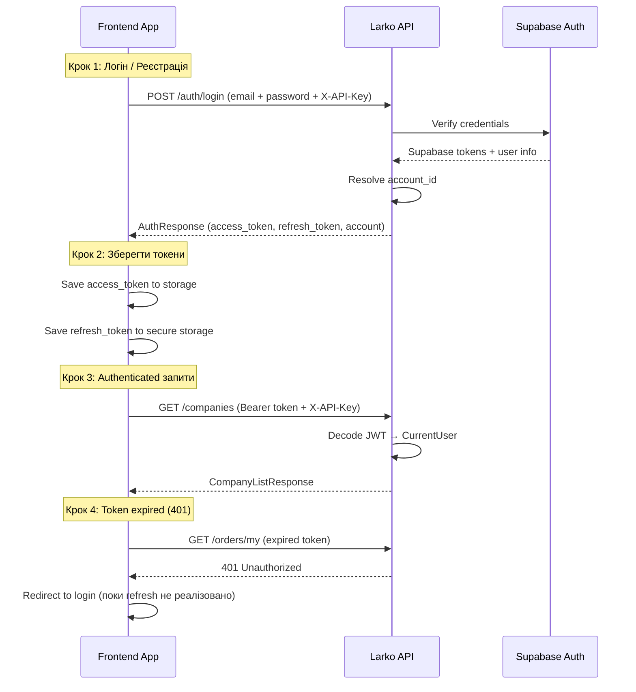

# Frontend Integration Guide — Larko API

> **Версія**: 1.0 | **Дата**: 2026-03-31
>
> Цей документ — точка входу для фронтенд-розробника. Містить всю інформацію для швидкого підключення до API.

---

## 🚀 Quick Start: Підключення за 5 хвилин

### 1. Середовища (Environments)

| Середовище | Base URL | Swagger UI | Статус |
|---|---|---|---|
| **Staging** | `https://dev-api-larko.driveapp.work/api/v1` | [Swagger UI](https://dev-api-larko.driveapp.work/docs) | ✅ Активний |
| **Production** | `https://api-larko.driveapp.work/api/v1` | [Swagger UI](https://api-larko.driveapp.work/docs) | ✅ Активний |
| **Local** | `http://localhost:8080/api/v1` | [Swagger UI](http://localhost:8080/docs) | Для розробки |

> ⚠️ **Для розробки завжди використовуй Staging.** Production — тільки для релізних версій.

---

### 2. Обов'язкові Headers

Кожен запит до API **обов'язково** повинен містити:

```
X-API-Key: <FRONTEND_API_KEY>
Content-Type: application/json
```

А для захищених ендпоінтів (де Auth = ✅) ще:

```
Authorization: Bearer <access_token>
```

---

### 3. API Keys (X-API-Key)

API Key — це ключ доступу клієнтського додатку до бекенду. Без нього будь-який запит (крім `/health`) поверне `403 Forbidden`.

#### Staging API Keys

Використовуй **будь-який з цих ключів** для розробки:

```
IMuLwFzIMpJ7d7lQT9Q_9Z-uRNds3X0wUSuMHJS8bDM
```

або

```
CdnIorZ0fmr414EmXZX97Io9T95dgKSvcJNMZqmEmnI
```

> 💡 Один для TMA (Telegram Mini App), інший для Web Admin Panel. Для розробки можна використовувати будь-який.

#### Production API Keys

```
vdMA9KzNnOJC6INA1pyg4VpeABtovfu_khXoCAcVqD8
```

або

```
-Fujr9ZvDXSnldhcqU7J4qAKNm2Lq_u5ZE54x_K86fE
```

> ⚠️ Production ключі використовувати тільки в продакшн збірці!

---

### 4. Supabase Credentials

Для прямої роботи з Supabase (Storage для фото, Realtime підписки тощо):

#### Staging Supabase

| Параметр | Значення |
|---|---|
| **Project URL** | `https://vuqndgykpamwywatlzeo.supabase.co` |
| **Project Ref** | `vuqndgykpamwywatlzeo` |
| **Anon Key** | Отримати з Supabase Dashboard → Settings → API |

#### Production Supabase

| Параметр | Значення |
|---|---|
| **Project URL** | `https://evbjfcikigsuqkstednh.supabase.co` |
| **Project Ref** | `evbjfcikigsuqkstednh` |
| **Anon Key** | Отримати з Supabase Dashboard → Settings → API |

> 💡 `Anon Key` (публічний) — потрібен для Supabase JS Client на фронті. НЕ плутати з `Service Role Key` (серверний, секретний).

---

### 5. Перший запит — Перевірка з'єднання

```bash
# Health check (не потребує ніяких ключів)
curl https://dev-api-larko.driveapp.work/health

# Очікувана відповідь:
# {"status": "ok"}
```

```bash
# Запит з API Key
curl -H "X-API-Key: IMuLwFzIMpJ7d7lQT9Q_9Z-uRNds3X0wUSuMHJS8bDM" \
     https://dev-api-larko.driveapp.work/api/v1/auth/me

# Очікувана відповідь (без JWT):
# {"detail": "Authorization header required"}  ← 401 — це нормально!
```

Якщо отримаєш `403 API key required` — перевір заголовок `X-API-Key`.

---

## 🔐 Authentication Guide

### Схема автентифікації

```
┌─────────────────────────────────────────────────────────────┐
│                     Рівні захисту API                        │
├─────────────────────────────────────────────────────────────┤
│                                                             │
│  1. X-API-Key (middleware)                                  │
│     → Ідентифікує клієнтський додаток                       │
│     → Обов'язковий для ВСІХ запитів (крім /health)          │
│                                                             │
│  2. Authorization: Bearer <JWT> (per-endpoint)              │
│     → Ідентифікує користувача                               │
│     → Obов'язковий для захищених ендпоінтів                 │
│                                                             │
│  3. RBAC (per-endpoint dependency)                          │
│     → Перевіряє роль в конкретній компанії                  │
│     → owner > manager > worker                              │
│                                                             │
└─────────────────────────────────────────────────────────────┘
```

---

### Flow 1: Email/Password (Web Admin)

#### Реєстрація

```http
POST /api/v1/auth/register
Headers:
  Content-Type: application/json
  X-API-Key: IMuLwFzIMpJ7d7lQT9Q_9Z-uRNds3X0wUSuMHJS8bDM

{
  "email": "admin@company.com",
  "password": "SecurePass123!",
  "full_name": "Олександр Коваль"
}
```

**Response (201):**
```json
{
  "tokens": {
    "access_token": "eyJhbGciOiJIUzI1NiIs...",
    "refresh_token": "eyJhbGciOiJIUzI1NiIs...",
    "token_type": "bearer",
    "expires_in": 3600
  },
  "account": {
    "id": "550e8400-e29b-41d4-a716-446655440000",
    "email": "admin@company.com",
    "full_name": "Олександр Коваль",
    "language": "uk",
    "telegram_id": null,
    "trial_used": false,
    "created_at": "2026-03-31T10:00:00Z"
  }
}
```

#### Логін

```http
POST /api/v1/auth/login
Headers:
  Content-Type: application/json
  X-API-Key: IMuLwFzIMpJ7d7lQT9Q_9Z-uRNds3X0wUSuMHJS8bDM

{
  "email": "admin@company.com",
  "password": "SecurePass123!"
}
```

**Response (200):** Та ж структура `AuthResponse`.

---

### Flow 2: Telegram Mini App (TMA)

#### Автентифікація через Telegram initData

```http
POST /api/v1/auth/telegram
Headers:
  Content-Type: application/json
  X-API-Key: IMuLwFzIMpJ7d7lQT9Q_9Z-uRNds3X0wUSuMHJS8bDM

{
  "init_data": "query_id=AAH...&user=%7B%22id%22%3A123456%2C...%7D&hash=abc...",
  "full_name": "Іван Петренко",
  "language": "uk"
}
```

> `init_data` отримується з `window.Telegram.WebApp.initData` (raw string).
> Бекенд валідує HMAC підпис Telegram для запобігання підробки.

**Response (200):** Та ж структура `AuthResponse`.

---

### Зберігання та використання токенів

#### Access Token

| Властивість | Значення |
|---|---|
| Тип | JWT (HS256) |
| Термін дії | **1 година** (3600 секунд) |
| Де зберігати | `localStorage` (Web) або `SecureStorage` (Flutter) |
| Як використовувати | `Authorization: Bearer <token>` |

#### Refresh Token

| Властивість | Значення |
|---|---|
| Тип | Opaque string |
| Термін дії | **30 днів** |
| Де зберігати | `SecureStorage` (НЕ в localStorage для продакшн) |
| Як використовувати | `POST /api/v1/auth/refresh` (⏳ TODO) |

> ⚠️ **Refresh endpoint ще не реалізований.** Поки що при 401 помилці — перенаправляй на повторний логін. Токен живе 1 годину.

---

### Визначення поточного користувача

```http
GET /api/v1/auth/me
Headers:
  X-API-Key: <key>
  Authorization: Bearer <access_token>
```

**Response (200):**
```json
{
  "id": "uuid",
  "email": "admin@company.com",
  "full_name": "Олександр Коваль",
  "language": "uk",
  "telegram_id": null,
  "trial_used": false,
  "created_at": "2026-03-31T10:00:00Z"
}
```

---

### Повний Auth Flow (покроково)



---

## 🌐 CORS — Дозволені Origins

### Staging

```json
["http://localhost:3000", "http://localhost:5173"]
```

### Production

```json
["https://larko.ai", "http://localhost:3000", "http://localhost:5173"]
```

> Якщо фронтенд запускається на іншому порті — потрібно додати його в `CORS_ORIGINS` на бекенді.

---

## 🛡️ Rate Limiting

| Тип | Ліміт |
|---|---|
| Глобальний | **300 запитів/хвилину** на IP |
| Auth ендпоінти | **5 запитів/хвилину** на IP |

При перевищенні ліміту API повертає `429 Too Many Requests`.

---

## 📋 Чек-лист налаштування

Для старту розробки переконайся, що маєш:

- [ ] **Staging Base URL**: `https://dev-api-larko.driveapp.work`
- [ ] **API Key** (X-API-Key header): `IMuLwFzIMpJ7d7lQT9Q_9Z-uRNds3X0wUSuMHJS8bDM`
- [ ] **Swagger UI** працює: відкрий [https://dev-api-larko.driveapp.work/docs](https://dev-api-larko.driveapp.work/docs)
- [ ] **Health check** працює: `curl https://dev-api-larko.driveapp.work/health`
- [ ] Зареєстровано тестовий акаунт через `POST /api/v1/auth/register`
- [ ] Створено першу компанію через `POST /api/v1/companies`
- [ ] Ознайомлено з [API Endpoints Reference](./api_endpoints_reference.md)
- [ ] Ознайомлено з [Error Codes](./error_codes.md)

---

## 📂 Зв'язані документи

| Документ | Опис |
|---|---|
| [api_endpoints_reference.md](./api_endpoints_reference.md) | Стислий довідник усіх 98 ендпоінтів |
| [api_endpoints_detailed.md](./api_endpoints_detailed.md) | Детальні поля, валідації, типи для кожного ендпоінту |
| [error_codes.md](./error_codes.md) | Каталог помилок + рекомендації для фронту |
| [notifications.md](./notifications.md) | 10 типів подій і повідомлень |
| [workflow_docs/auth_workflow.md](./workflow_docs/auth_workflow.md) | Auth flow: Telegram Mini App + Web |
| [workflow_docs/orders_workflow.md](./workflow_docs/orders_workflow.md) | Замовлення: повний цикл |
| [adr/architecture_decisions.md](./adr/architecture_decisions.md) | 16 архітектурних рішень бекенду |

---

## 💡 HTTP Client Boilerplate

### JavaScript / TypeScript (axios)

```typescript
import axios from 'axios';

const STAGING_BASE_URL = 'https://dev-api-larko.driveapp.work';
const API_KEY = 'IMuLwFzIMpJ7d7lQT9Q_9Z-uRNds3X0wUSuMHJS8bDM';

const api = axios.create({
  baseURL: `${STAGING_BASE_URL}/api/v1`,
  headers: {
    'Content-Type': 'application/json',
    'X-API-Key': API_KEY,
  },
});

// Додати Bearer token після логіну
api.interceptors.request.use((config) => {
  const token = localStorage.getItem('access_token');
  if (token) {
    config.headers.Authorization = `Bearer ${token}`;
  }
  return config;
});

// Обробка 401 — redirect на логін
api.interceptors.response.use(
  (response) => response,
  (error) => {
    if (error.response?.status === 401) {
      localStorage.removeItem('access_token');
      window.location.href = '/login';
    }
    return Promise.reject(error);
  }
);

export default api;
```

### Dart / Flutter (dio)

```dart
import 'package:dio/dio.dart';

class ApiClient {
  static const _stagingBaseUrl = 'https://dev-api-larko.driveapp.work';
  static const _apiKey = 'IMuLwFzIMpJ7d7lQT9Q_9Z-uRNds3X0wUSuMHJS8bDM';

  late final Dio _dio;

  ApiClient() {
    _dio = Dio(BaseOptions(
      baseUrl: '$_stagingBaseUrl/api/v1',
      headers: {
        'Content-Type': 'application/json',
        'X-API-Key': _apiKey,
      },
    ));

    _dio.interceptors.add(InterceptorsWrapper(
      onRequest: (options, handler) {
        final token = _getAccessToken();
        if (token != null) {
          options.headers['Authorization'] = 'Bearer $token';
        }
        handler.next(options);
      },
      onError: (error, handler) {
        if (error.response?.statusCode == 401) {
          _redirectToLogin();
        }
        handler.next(error);
      },
    ));
  }

  String? _getAccessToken() {
    // Read from SecureStorage
    return null;
  }

  void _redirectToLogin() {
    // Navigate to login screen
  }
}
```

### Telegram Mini App (fetch)

```javascript
const API_KEY = 'IMuLwFzIMpJ7d7lQT9Q_9Z-uRNds3X0wUSuMHJS8bDM';
const BASE_URL = 'https://dev-api-larko.driveapp.work/api/v1';

// Крок 1: Авторизація через Telegram initData
async function authenticate() {
  const initData = window.Telegram.WebApp.initData;
  const startParam = window.Telegram.WebApp.initDataUnsafe?.start_param;

  const res = await fetch(`${BASE_URL}/auth/telegram`, {
    method: 'POST',
    headers: {
      'Content-Type': 'application/json',
      'X-API-Key': API_KEY,
    },
    body: JSON.stringify({
      init_data: initData,
      full_name: window.Telegram.WebApp.initDataUnsafe?.user?.first_name || 'User',
      language: 'uk',
    }),
  });

  const data = await res.json();
  localStorage.setItem('access_token', data.tokens.access_token);

  // Крок 2: Якщо є invite code — приєднатися до компанії
  if (startParam) {
    await joinCompany(startParam, data.tokens.access_token);
  }

  return data;
}

async function joinCompany(inviteCode, token) {
  await fetch(`${BASE_URL}/members/join`, {
    method: 'POST',
    headers: {
      'Content-Type': 'application/json',
      'X-API-Key': API_KEY,
      'Authorization': `Bearer ${token}`,
    },
    body: JSON.stringify({
      invite_code: inviteCode,
      full_name: window.Telegram.WebApp.initDataUnsafe?.user?.first_name || 'User',
    }),
  });
}
```

---

## ❓ FAQ

### Чому я отримую `403 API key required`?
Ти не передаєш заголовок `X-API-Key`. Додай його до кожного запиту.

### Чому я отримую `401 Unauthorized`?
Або відсутній `Authorization: Bearer <token>`, або токен протермінований (> 1 год). Перелогінься.

### Чому `422 Validation Error`?
Невалідні дані в тілі запиту. Дивись `errors[]` масив у відповіді — там є конкретні поля з помилками.

### Чому `403 Forbidden` (не plan_limit)?
RBAC — у тебе немає ролі для цієї операції. Наприклад, worker намагається створити замовлення (потрібен owner/manager).

### Чому `403 Plan Limit Exceeded`?
Досягнуто ліміт тарифного плану. Покажи юзеру модалку "Upgrade Plan".

### Де взяти Swagger?
- Staging: https://dev-api-larko.driveapp.work/docs
- Production: https://api-larko.driveapp.work/docs

### Чи потрібно самому підключати Supabase JS Client?
Тільки для **Supabase Storage** (завантаження фото). Для всього іншого — працюй через наш REST API.
