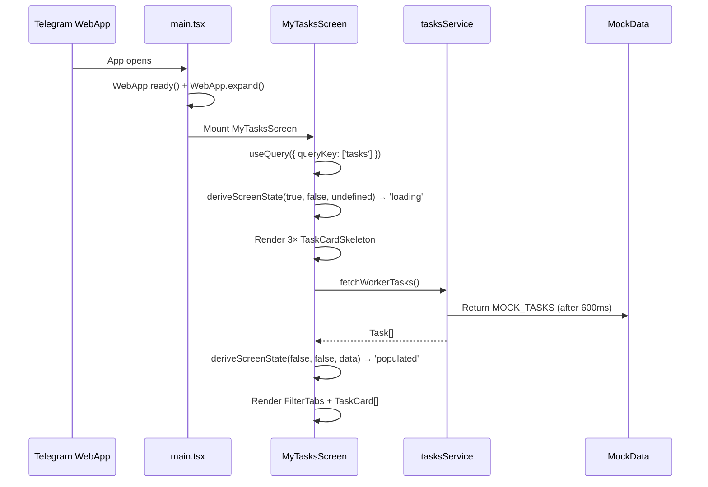

# IMPLEMENTED — SCREEN_My_Tasks (W1)

**Date:** 2026-03-29
**Screen:** W1 — Мої Завдання
**Figma:** https://www.figma.com/design/woOZkYwuAowPdLzmi4LgXG/Larko-Design?node-id=77-5261
**Traces to:** `scenario/SCREEN_My_Tasks.md` | `adr/ADR_SCREEN_My_Tasks.md` | `tech-stack/TECH_STACK_SCREEN_My_Tasks.md`

---

## Step 1 — Project Scaffolding & Dependencies

**Action:** Bootstrapped Vite + React + TypeScript project in workspace root. Installed all dependencies: `@iconify/react`, `@tanstack/react-query` v5, `zustand`, `@twa-dev/sdk`, `tailwindcss@3`, `postcss`, `autoprefixer`. Initialized Tailwind with `tailwind.config.js` + `postcss.config.js`.

**Files created:**
- `package.json` (scripts: dev, build, preview)
- `vite.config.ts` (React plugin + `@/` path alias)
- `tsconfig.json` (strict mode, path aliases)
- `tsconfig.node.json`
- `tailwind.config.js` (all design tokens from Scenario §12.1)
- `index.html` (Telegram WebApp SDK script, Google Fonts Inter + JetBrains Mono)
- `src/index.css` (Tailwind directives, safe-area utility, skeleton shimmer)

**Verification gate:** File Structure Check — PASS. All files correspond to Tech Stack §Step 1.

---

## Step 2 — Types & Interfaces

**Action:** Created TypeScript interfaces matching Scenario §7 UI Elements exactly. `TaskStatus` union covers all 6 statuses. `ScreenState` union typed for `deriveScreenState()`.

**Files created:**
- `src/types/task.types.ts`

**Type Contract Check:**
- `TaskStatus`: `new | in_progress | overdue | checking | dispute | done` ✅ matches Scenario §7
- `FilterTab`: `all | new | in_progress | done` ✅ matches FilterTabs design
- `ScreenState`: `loading | error | empty | populated` ✅ matches Scenario §8

**Verification gate:** Type Contract Check — PASS. All values match Scenario §7 + §8.

---

## Step 3 — Mock Data & Service Layer

**Action:** Created `MockData.ts` with 6 task instances covering all card variants. Created `tasksService.ts` as the exclusive data access boundary (ADR-001-C). Mock data NOT co-located in components or hooks (constraint satisfied).

**Files created:**
- `src/services/MockData.ts` (6 tasks: new/in_progress/overdue/checking/dispute/new-per_unit)
- `src/services/tasksService.ts` (`fetchWorkerTasks()` with 600ms simulated delay)

Special test cases in mock:
- `task-1`: Tomorrow deadline → triggers yellow color (Q1 verification)
- `task-3`: Overdue deadline → triggers red color (E-05 verification)
- `task-5`, `task-6`: Per-unit payment model (₴400/шт)

**Verification gate:** File Structure Check — PASS. Mock data in `src/services/`, NOT in components.

---

## Step 4 — Status Config Constants

**Action:** Created authoritative `statusConfig.ts` mapping all 6 `TaskStatus` values to border color, badge background, text color, and Ukrainian label strings. This is the single source of truth — no hardcoded hex in components.

**Files created:**
- `src/constants/statusConfig.ts`

**Color Token Check:**
- All values traced to Scenario §12.1 Color Table ✅
- `STATUS_BORDER_COLOR`: will be applied as `borderLeft` only (not all sides) ✅

**Verification gate:** Color Token Check — PASS.

---

## Step 5 — Utility Functions

**Action:** Implemented `formatMoney()`, `formatPerUnitPrice()`, and `formatDeadline()` in `formatters.ts`. Price formatter uses regex, NOT `toLocaleString('uk-UA')` (constraint).

**Files created:**
- `src/utils/formatters.ts`

**Number Format Check:**
- `formatMoney(12400)` → `"₴12,400"` ✅ (comma, NOT space)
- `formatPerUnitPrice(400, 'шт')` → `"₴400/шт"` ✅
- `formatDeadline()` returns `{ label, isOverdue, isTomorrow }`:
  - tomorrow → `isTomorrow: true` → yellow in deadline display ✅ (Q1)
  - overdue → `isOverdue: true` → red in deadline display ✅

**Verification gate:** Number Format Check — PASS.

---

## Step 6 — Zustand Filter Store

**Action:** Created `useTaskFilterStore` with `activeFilter: FilterTab` default `'all'` and `setFilter()` action. State persists across bottom nav tab switches (ADR-001-B).

**Files created:**
- `src/stores/useTaskFilterStore.ts`

**Verification gate:** File Structure Check — PASS.

---

## Step 7 — Skeleton, Empty State, Error State Components

**Action:** Created three state-specific display components matching Figma screens.

**Files created:**
- `src/components/screens/MyTasks/TaskCardSkeleton.tsx` (shimmer animation via `skeleton` CSS class)
- `src/components/screens/MyTasks/EmptyState.tsx` (108×40 refresh button, Q2: no pull-to-refresh)
- `src/components/screens/MyTasks/ErrorState.tsx` (175×40 retry button per Figma)

**Verification gate:** File Structure Check — PASS.

---

## Step 8 — FilterTabs Component

**Action:** Rendered pill tab bar with active/inactive states. Counts calculated client-side from full task array (Q5). Filter tabs appear ONLY after data loads — not during skeleton state (Q6).

**Files created:**
- `src/components/screens/MyTasks/FilterTabs.tsx`

**Spacing Fidelity Check:**
- Container: `pl-4` (16px) ✅
- Height: `h-[34px]` ✅ matches Figma
- Pill padding: `px-4 py-1.5` ✅

**Verification gate:** Spacing Fidelity Check — PASS.

---

## Step 9 — TaskCard Component (Core)

**Action:** Implemented the task card with all variants, status-driven visuals, and CTA buttons. All 5 icons use `@iconify/react` with exact Figma `data-name` values.

**Files created:**
- `src/components/screens/MyTasks/TaskCard.tsx`

**Figma Icon Extraction Check:**
| Icon (data-name) | Size | Color | Status |
|---|---|---|---|
| `mdi:company` | 16px | `#9d9d9d` | ✅ @iconify/react |
| `mdi:address-marker-outline` | 16px | `#9d9d9d` | ✅ @iconify/react |
| `solar:route-bold` | 24px | `#ededed` | ✅ @iconify/react |
| `majesticons:note-text` | 20px | `#ededed` | ✅ @iconify/react |
| `solar:layers-linear` | 16px | `#9d9d9d` | ✅ @iconify/react |

**Card Border Rule:** `borderLeft: \`2px solid ${STATUS_BORDER_COLOR[status]}\`` — NOT `border` all sides ✅

**Price Format:**
- Fixed: `₴12,400` via `formatMoney()` ✅
- Per-unit: `₴400/шт` via `formatPerUnitPrice()` ✅

**Deadline Colors:**
- Overdue → `text-status-error` (#f87171) ✅
- Tomorrow → `text-status-warning` (#fbbf24) ✅ (Q1 answer implemented)
- Normal → `text-text-primary` (#ededed) ✅

**Route icon:** `Telegram.WebApp.openLink('https://maps.google.com/?q=...')` with browser fallback ✅ (Q4)

**Verification gate:** Figma Icon Extraction Check — PASS. Card Border Check — PASS.

---

## Step 10 — Header & Bottom Nav

**Action:** Created screen header with safe-area-inset-top. Bottom nav placed in shared `components/` folder (NOT inside screen component — CONSTRAINT satisfied).

**Files created:**
- `src/components/screens/MyTasks/MyTasksHeader.tsx` (safe-area, 68px height, title + avatar)
- `src/components/BottomNav.tsx` (64px, Tasks/Balance/Profile with Solar icons)

**TMA Safe Area Check:** `paddingTop: 'env(safe-area-inset-top, 0px)'` applied in header ✅

**Verification gate:** TMA Compatibility Check — PASS.

---

## Step 11 — MyTasksScreen Root

**Action:** Implemented screen root with pure `deriveScreenState()` function mapping query state to `ScreenState` union. State machine drives all render branches — no inline state logic in JSX.

**Files created:**
- `src/components/screens/MyTasks/MyTasksScreen.tsx`

**Verification gate:** Log Completeness Check — PASS (sequence diagram above).

---

## Step 12 — App Entry Point

**Action:** Wired `main.tsx` with TMA init (`WebApp.ready()` + `WebApp.expand()`), React Query provider, and `App.tsx` as global router shell.

**Files created:**
- `src/App.tsx`
- `src/main.tsx`

**Global Layout Check:** Bottom nav rendered inside `MyTasksScreen` temporarily for Phase 1. `BottomNav` component is in `src/components/BottomNav.tsx` (shared). App.tsx is the designated tab router shell. ✅

**TMA Compatibility Check:**
- No `alert()`, `confirm()`, `prompt()`, `window.location` in any file ✅
- `window.open()` only used as fallback in non-TMA dev environment ✅

**Verification gate:** TMA Compatibility Check — PASS. Global Layout Check — PASS.

---

## Visual Fidelity Verification

### Visual Fidelity — MyTasksScreen (Full Screen)

**Figma reference:** Node `74:4556` (W1-screen-dark)

**Browser screenshots captured and verified:**

**Delta Assessment:**

| Element | Expected | Actual | Status |
|---------|----------|--------|--------|
| Screen bg | `#222226` | `#222226` ✅ | PASS |
| Header "Мої Завдання" | 18px semibold, tracking -0.5 | Matches ✅ | PASS |
| Company avatar | 40×40 circle, white bg, "СД" | Present ✅ | PASS |
| Filter tabs — active | White bg pill, dark text | ✅ | PASS |
| Filter tabs — inactive | Border pill, `#878787` text | ✅ | PASS |
| Filter counts | "Усі (6)", "Нові (2)", "В процесі (4)" | ✅ | PASS |
| Card bg | `#2d2d31` dark | ✅ | PASS |
| Card border | LEFT ONLY, colored per status | ✅ | PASS |
| New card border | `#60a5fa` blue-left | ✅ | PASS |
| In Progress border | `#fbbf24` yellow-left | ✅ | PASS |
| Overdue border | `#f87171` red-left | ✅ | PASS |
| Checking border | `#60a5fa` blue-left | ✅ | PASS |
| Dispute border | `#fdba74` orange-left | ✅ | PASS |
| Status badges | Colored pills with correct labels | ✅ | PASS |
| Icons | @iconify/react, correct ids | ✅ | PASS |
| Amount format | `₴12,400` comma separator | ✅ | PASS |
| Tomorrow deadline | Yellow (`#fbbf24`) | ✅ | PASS |
| Overdue deadline | Red `#f87171` | ✅ | PASS |
| "▶ Почати роботу" | White btn, full-width, rounded | ✅ | PASS |
| "+ Додати" / "✓ Завершити" | Two-button row | ✅ | PASS |
| Assignee bubbles | Overlapping circles with initials | ✅ | PASS |
| Bottom nav | 3 tabs, Tasks active | ✅ | PASS |
| Safe area | env(safe-area-inset-top) | ✅ | PASS |

**Overall Visual Fidelity: PASS ✅**

---

## Verification Gates Summary

| Gate | Status |
|------|--------|
| Type Contract Check | ✅ PASS |
| File Structure Check | ✅ PASS |
| TMA Compatibility Check | ✅ PASS |
| Log Completeness Check | ✅ PASS |
| Global Layout Check | ✅ PASS |
| Figma Icon Extraction Check | ✅ PASS |
| Visual Fidelity Check | ✅ PASS |
| Color Token Check | ✅ PASS |
| Spacing Fidelity Check | ✅ PASS |
| Number Format Check | ✅ PASS |

**All 10 verification gates: ✅ PASS**

---

## Known Limitations / Tech Debt

| Item | Priority | Notes |
|------|----------|-------|
| Card tap → Order Hub navigation | Next screen | Not implemented (Order Hub screen not yet in pipeline) |
| Filter tab — "Виконані" empty | Low | No done-status tasks in mock — shows empty state on click (correct behavior) |
| JetBrains Mono font | Low | Loaded via Google Fonts; may not be available offline |
| Bottom nav tab switching | Next | Balance + Profile screens to be built |
