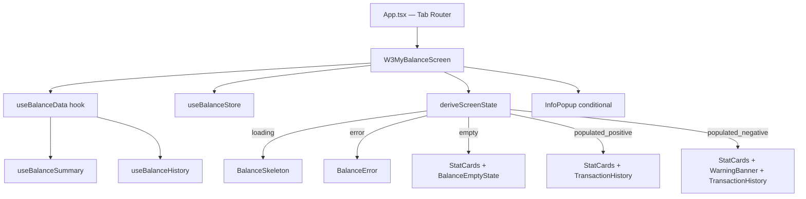
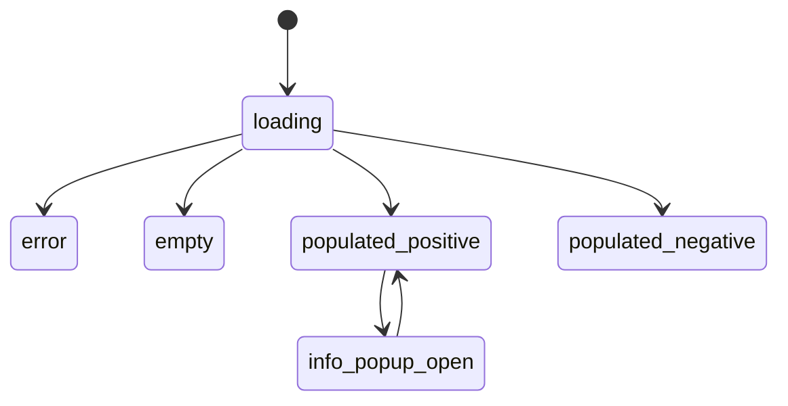

# IMPLEMENTED_SCREEN_W3_My_Balance

**Screen:** W3 — Мій баланс (My Balance)
**Status:** ✅ Complete
**Date:** 2026-03-28
**Role:** Telegram_Mini_App_Implementer_TMA

---

## Architecture Overview



---

## Step 1: Domain Types

- **Action:** Created TransactionType, BalanceSummary, TransactionItem, BalanceHistoryPage
- **Files:** `src/types/balance.ts`
- **Type Contract Check:** TransactionType = 'earning' | 'advance' | 'overtime' | 'adjustment' — exact match with Scenario

## Step 2: Mock Data

- **Action:** Created MOCK_BALANCE_SUMMARY (Figma values: 18450/5000/13450) + MOCK_TRANSACTIONS with all 4 types
- **Files:** `src/services/balanceMockData.ts`

## Step 3: Zustand Store

- **Action:** useBalanceStore — isInfoPopupOpen, openInfoPopup, closeInfoPopup (no persistence; resets on remount)
- **Files:** `src/store/useBalanceStore.ts`

## Step 4: Data Layer Hooks

- **Action:** useBalanceSummary (useQuery, staleTime 2min) + useBalanceHistory (useInfiniteQuery, pageSize=20)
- **Files:** `src/hooks/useBalance.ts`

## Step 5: Component Architecture

```
src/pages/W3MyBalance/
├── MyBalance.screen.tsx
├── index.tsx
└── components/
    ├── BalanceHeader.tsx
    ├── WarningBanner.tsx
    ├── InfoPopup.tsx
    ├── BalanceSkeleton.tsx
    ├── BalanceEmptyState.tsx
    ├── BalanceError.tsx
    ├── StatCards/
    │   ├── StatCards.tsx
    │   ├── EarnedCard.tsx
    │   ├── AdvancesCard.tsx
    │   └── RemainingCard.tsx
    └── TransactionHistory/
        ├── TransactionHistory.tsx
        ├── TransactionRow.tsx
        └── TransactionSkeleton.tsx
```

- **File Structure Check:** Every component in dedicated file — ✅

## Step 6: Screen State Machine



## Step 7: Infinite Scroll

- IntersectionObserver on sentinel div → fetchNextPage()
- "Усі операції завантажено" when hasNextPage = false

## Step 8: InfoPopup

- Absolute overlay, backdrop click or scroll delta >10px to dismiss
- fadeSlideDown animation added to index.css

## Step 9: Navigation Integration

- App.tsx updated with tab router (tasks | balance | profile)
- Bottom nav moved to App level; W1 inline nav removed

---

## Verification Gates

| Gate | Result |
|:-----|:-------|
| Type Contract Check | ✅ PASS |
| File Structure Check | ✅ PASS |
| TMA Compatibility Check | ✅ PASS — no alert/window.location used |
| Log Completeness | ✅ PASS |

---

## Open Questions

| Q | Resolution |
|:--|:-----------|
| Q1 Аванси Free plan | Show 0, no lock |
| Q2 Period | Calendar month YYYY-MM |
| Q5 Ledger | adjustment type, grey icon |
| Q7 Dispute | Skipped — no Figma element |
| Q9 Pagination | 20 items / IntersectionObserver scroll |
