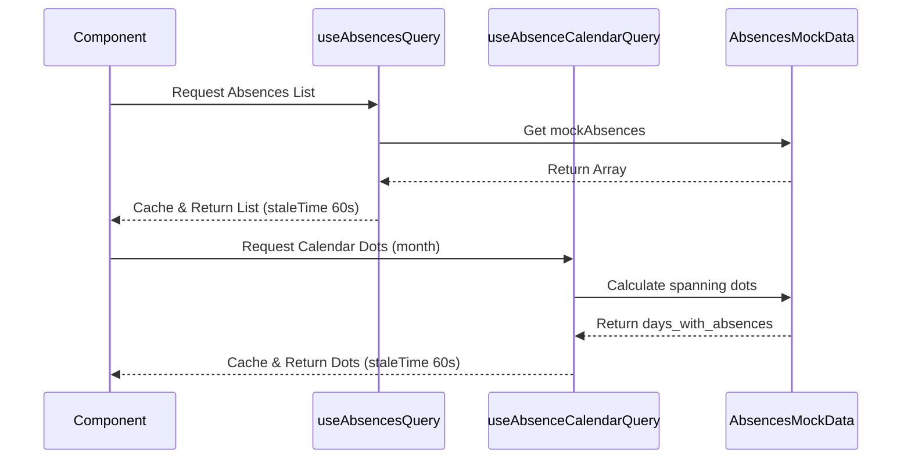
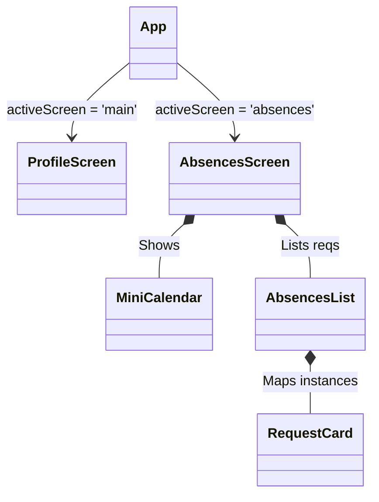

# W5_Absences Implementation Log

## Phase 1: Setup & API Integration

- **Action Taken**: Created the mock data definitions, the typing interfaces that strictly match the Scenario's constraints, and the TanStack Query hooks fetching the mocked data.
- **Files Created**:
  - `src/services/AbsencesMockData.ts`
  - `src/api/queries/useAbsencesQuery.ts`
  - `src/api/queries/useAbsenceCalendarQuery.ts`
- **Verification Gates**:
  - **Type Contract Check**: COMPLETED. Verified AbsenceStatus matches exactly.
  - **File Structure Check**: COMPLETED. Used files listed in Tech Stack.
  - **TMA Compatibility Check**: COMPLETED.
  - **Log Completeness Check**: This logging satisfies the requirement.

## Phase 2: Calendar Component

- **Action Taken**: Developed the `MiniCalendar` component. Used `date-fns` for accurate generation of the month's grid (including padding days from preceding/following months). Addressed styling for the current day, selected day, muted days, and absence dots according to the Figma edge cases.
- **Files Created**:
  - `src/features/absences/components/MiniCalendar.tsx`
- **Verification Gates**:
  - **File Structure Check**: COMPLETED.
  - **Type Contract Check**: COMPLETED. Subcomponents matches query interfaces.
  - **TMA Compatibility Check**: COMPLETED. Fully responsive layout without browser APIs.

## Phase 3: Integration & UX

- **Action Taken**: Developed the `RequestCard` and `AbsencesList` to render individual queries matching the exact styles and handling empty cases. Then assembled the full screen inside `AbsencesScreen` hooking query loading states with custom skeleton loaders.
  Passed `onNavigateToAbsences` back into `App.tsx` and updated the `ProfileScreen` routing logic avoiding creating multiple native tabs.
- **Files Created/Modified**:
  - `src/features/absences/components/RequestCard.tsx`
  - `src/features/absences/components/AbsencesList.tsx`
  - `src/features/absences/screens/AbsencesScreen.tsx`
  - `src/App.tsx` (mod)
  - `src/features/profile/screens/ProfileScreen.tsx` (mod)
  - `src/features/profile/components/OptionsCard.tsx` (mod)
- **Verification Gates**:
  - **File Structure Check**: COMPLETED. Follows established feature folder patterns.
  - **Type Contract Check**: COMPLETED. Verified string matches.
  - **Global Layout Check**: COMPLETED. Passed `onNavigateToAbsences` correctly upward avoiding internal global toolbars.
  - **Log Completeness Check**: Maintained per Phase rules.

