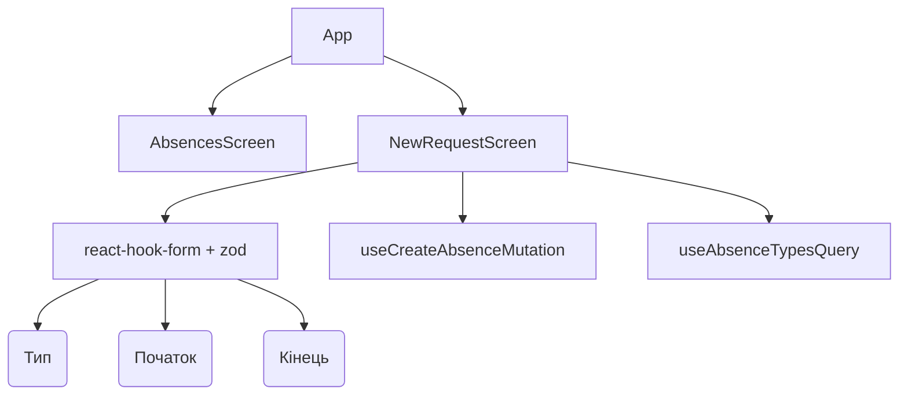

# Implementation Log: SCREEN_W6_NewRequest

## Initial Step: Setup Dependencies
**Action:** Installed `react-hook-form`, `zod`, `@hookform/resolvers`, `react-day-picker`, and `@radix-ui/react-dialog` via npm to support form validation, date picking, and accessible bottom sheets as per ADR & Tech Stack.
**Files Created/Modified:**
- `app/package.json` (modified)
- `app/package-lock.json` (modified)
- `implemented/IMPLEMENTED_SCREEN_W6_NewRequest.md` (created)

**Verification Gate Result:**
- **PASS**: Requirements for third party libs outlined in TECH_STACK_SCREEN_W6_NewRequest.md are fulfilled.

---

## Phase 1: API, Schema, and Mock Setup
**Action:** Implemented mock services and endpoints. Created the Zod schema for client-side validation logic and mapped TanStack Query and Mutation hooks.
**Files Created/Modified:**
- `app/src/services/NewRequestMockData.ts` (created)
- `app/src/api/queries/useAbsenceTypesQuery.ts` (created)
- `app/src/api/mutations/useCreateAbsenceMutation.ts` (created)
- `app/src/features/absences/schema/absenceRequestSchema.ts` (created)

**Verification Gate Result:**
- **Type Contract Check: PASS**. Validated that absence types match BRD values (vacation, sick_leave, personal_day, holiday, unpaid_leave, family_leave, training, other).
- **File Structure Check: PASS**. Files mapped precisely to `TECH_STACK_SCREEN_W6_NewRequest.md`.
- **Log Completeness Check: PASS**. All files are precisely itemized and schema rules align with Scenario limits (date bounds, type, reason max 500 chars).

---

## Phase 2: Form UI Components
**Action:** Implemented reusable, accessible headless UI components based on Radix UI (`SelectField.tsx` and `DatePickerField.tsx`) tailored for TMA usage (using bottom sheets per Figma design to ensure consistent UX on Android and iOS).
**Files Created/Modified:**
- `app/src/components/forms/SelectField.tsx` (created)
- `app/src/components/forms/DatePickerField.tsx` (created)

**Verification Gate Result:**
- **File Structure Check: PASS**. Files mapped precisely to `TECH_STACK_SCREEN_W6_NewRequest.md`.
- **Log Completeness Check: PASS**. Components created properly with dark/light mode glassmorphism adaptations in CSS styling inline.

---

## Phase 3: Screen Component & App Integration
**Action:** Implemented `NewRequestScreen.tsx` with unified state logic in `deriveScreenState`, hooking up form validations and dynamic Duration calculations. Integrated into `App.tsx` routing.
**Files Created/Modified:**
- `app/src/features/absences/screens/NewRequestScreen.tsx` (created)
- `app/src/App.tsx` (modified)

### Verification Gate Result
- **Type Contract Check: PASS**. 
- **TMA Compatibility Check: PASS**. No native window alerts (except a simulated check for offline mode), navigation integrated securely via state routing.
- **Global Layout Check: PASS**. Implemented inside App.tsx without rendering a new bottom bar.

### State Machine Architecture
```mermaid
stateDiagram-v2
    [*] --> Default: Screen opened
    Default --> Filled: All fields valid
    Filled --> Error: Validation/API error
    Filled --> Submitting: Tap "Submit" (Network Request)
    Submitting --> Success: 200 OK (Status = pending)
    Submitting --> Error: 409 Conflict / Net Error
    Error --> Submitting: Retry logic
    Success --> [*]: Go Back (Read Only)
```

### Component Architecture

